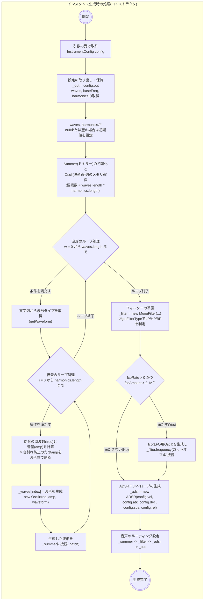

```mermaid

graph TD;
    %% コンストラクタの処理フロー
    subgraph Constructor ["<span style='white-space: nowrap;'>インスタンス生成時の処理(コンストラクタ)</span>"]
    direction TB
        Start((("開始"))) --> Args["引数の受け取り<br>InstrumentConfig config"]
        
        Args --> Extract["設定の取り出し・保持<br>_out = config.out<br>waves, baseFreq, harmonicsの取得"]
        
        Extract --> CheckNulls["waves, harmonicsが<br>nullまたは空の場合は初期値を設定"]
        
        CheckNulls --> InitSummer["Summer(ミキサー)の初期化と<br>Oscil(波形)配列のメモリ確保<br>(要素数 = waves.length * harmonics.length)"]
        
        InitSummer --> OuterLoopStart{"波形のループ処理<br>w = 0 から waves.length まで"}
        
        OuterLoopStart -- 条件を満たす --> GetWaveType["文字列から波形タイプを取得<br>(getWaveform)"]
        
        GetWaveType --> InnerLoopStart{"倍音のループ処理<br>i = 0 から harmonics.length まで"}
        
        InnerLoopStart -- 条件を満たす --> Calc["倍音の周波数(freq)と<br>音量(amp)を計算<br>※音割れ防止のためampを波形数で割る"]
        
        Calc --> CreateOscil["_waves[index] = 波形を生成<br>new Oscil(freq, amp, waveform)"]
        
        CreateOscil --> PatchSummer["生成した波形を<br>_summerに接続(.patch)"]
        
        PatchSummer --> InnerLoopStart
        
        InnerLoopStart -- ループ終了 --> OuterLoopStart
        
        OuterLoopStart -- ループ終了 --> FilterInit["フィルターの準備<br>_filter = new MoogFilter(...)<br>※getFilterTypeでLP/HP/BPを判定"]
        
        FilterInit --> CheckFCO{"fcoRate > 0 かつ<br>fcoAmount > 0 か？"}
        
        CheckFCO -- 満たす(Yes) --> SetupFCO["_fco(LFO用Oscil)を生成し<br>_filter.frequency(カットオフ)に接続"]
        CheckFCO -- 満たさない(No) --> ADSRInit["ADSRエンベロープの生成<br>_adsr = new ADSR(config.vol, config.atk, config.dec, config.sus, config.rel)"]
        SetupFCO --> ADSRInit
        
        ADSRInit --> PatchFinal["音声のルーティング設定<br>_summer -> _filter -> _adsr -> _out"]
        
        PatchFinal --> End1((("生成完了")))
    end

```
