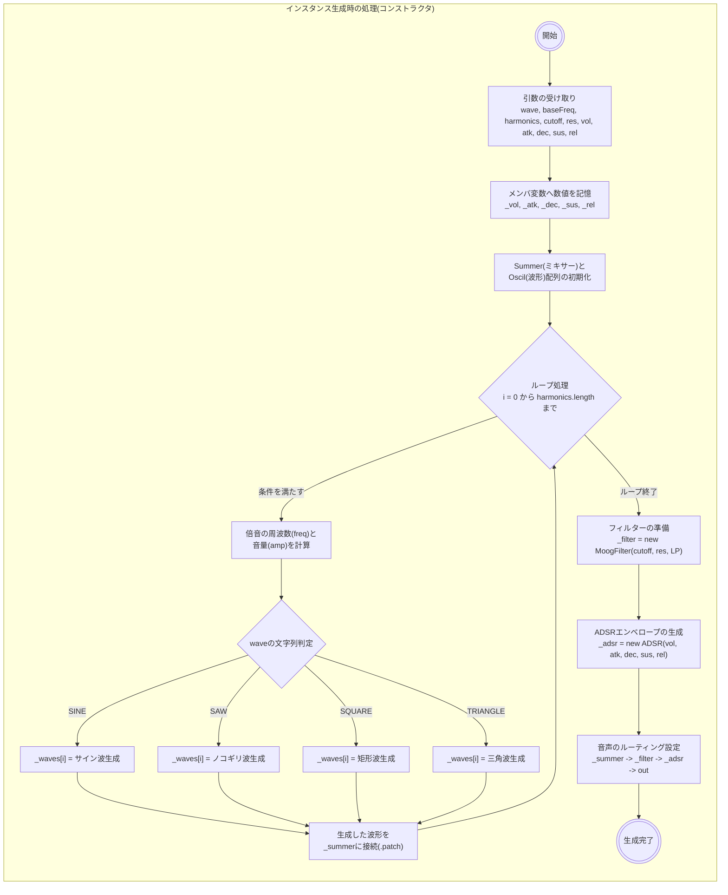

```mermaid

graph TD;
    %% コンストラクタの処理フロー
    subgraph Constructor ["<span style='white-space: nowrap;'>インスタンス生成時の処理(コンストラクタ)</span>"]
    direction TB
        Start((("開始"))) --> Args["引数の受け取り<br>wave, baseFreq, harmonics, cutoff, res, vol, atk, dec, sus, rel"]
        
        Args --> Assign["メンバ変数へ数値を記憶<br>_vol, _atk, _dec, _sus, _rel"]
        
        Assign --> InitSummer["Summer(ミキサー)と<br>Oscil(波形)配列の初期化"]
        
        InitSummer --> LoopStart{"ループ処理<br>i = 0 から harmonics.length まで"}
        
        LoopStart -- 条件を満たす --> Calc["倍音の周波数(freq)と<br>音量(amp)を計算"]
        
        Calc --> Cond{"waveの文字列判定"}
        
        Cond -- "SINE" --> WSine["_waves[i] = サイン波生成"]
        Cond -- "SAW" --> WSaw["_waves[i] = ノコギリ波生成"]
        Cond -- "SQUARE" --> WSquare["_waves[i] = 矩形波生成"]
        Cond -- "TRIANGLE" --> WTri["_waves[i] = 三角波生成"]
        
        WSine --> PatchSummer["生成した波形を<br>_summerに接続(.patch)"]
        WSaw --> PatchSummer
        WSquare --> PatchSummer
        WTri --> PatchSummer
        
        PatchSummer --> LoopStart
        
        LoopStart -- ループ終了 --> FilterInit["フィルターの準備<br>_filter = new MoogFilter(cutoff, res, LP)"]
        
        FilterInit --> ADSRInit["ADSRエンベロープの生成<br>_adsr = new ADSR(vol, atk, dec, sus, rel)"]
        
        ADSRInit --> PatchFinal["音声のルーティング設定<br>_summer -> _filter -> _adsr -> out"]
        
        PatchFinal --> End1((("生成完了")))
    end

```
