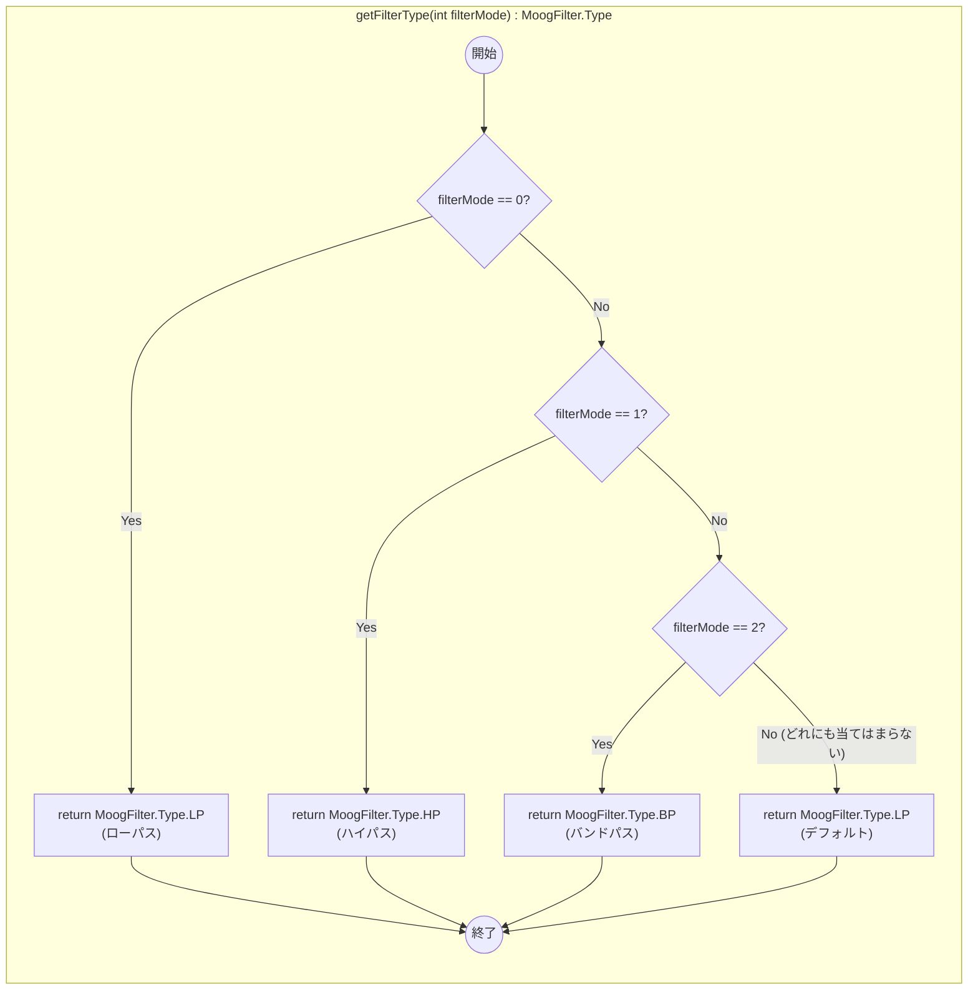

```mermaid

graph TD;
    subgraph getFilterType_Flow ["<span style='white-space: nowrap;'>getFilterType(int filterMode) : MoogFilter.Type</span>"]
        direction TB
        GF_Start((開始)) --> GF_Check0{"filterMode == 0?"}
        
        GF_Check0 -- Yes --> GF_RetLP["return MoogFilter.Type.LP<br>(ローパス)"]
        
        GF_Check0 -- No --> GF_Check1{"filterMode == 1?"}
        GF_Check1 -- Yes --> GF_RetHP["return MoogFilter.Type.HP<br>(ハイパス)"]
        
        GF_Check1 -- No --> GF_Check2{"filterMode == 2?"}
        GF_Check2 -- Yes --> GF_RetBP["return MoogFilter.Type.BP<br>(バンドパス)"]
        
        GF_Check2 -- No (どれにも当てはまらない) --> GF_RetDefLP["return MoogFilter.Type.LP<br>(デフォルト)"]

        GF_RetLP --> GF_End((終了))
        GF_RetHP --> GF_End
        GF_RetBP --> GF_End
        GF_RetDefLP --> GF_End
    end

```
