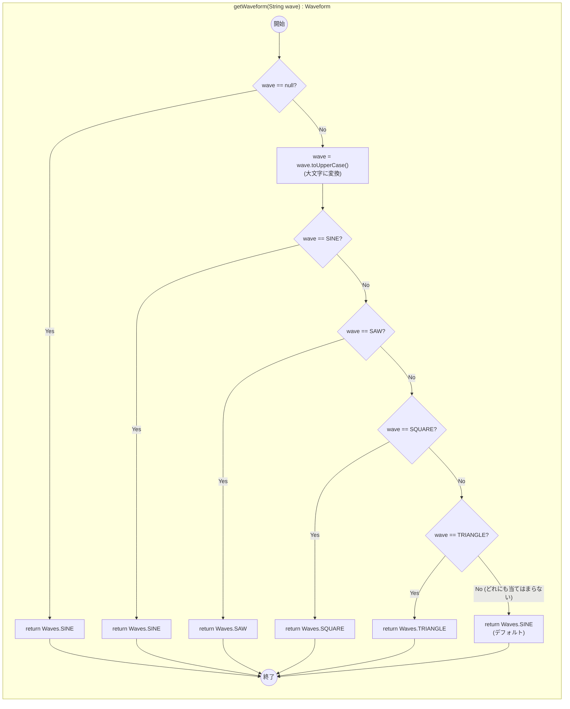

```mermaid

graph TD;
    subgraph getWaveform_Flow ["<span style='white-space: nowrap;'>getWaveform(String wave) : Waveform</span>"]
        direction TB
        GW_Start((開始)) --> GW_CheckNull{"wave == null?"}
        
        GW_CheckNull -- Yes --> GW_RetNullSine["return Waves.SINE"]
        GW_CheckNull -- No --> GW_ToUpper["wave = wave.toUpperCase()<br>(大文字に変換)"]
        
        GW_ToUpper --> GW_CheckSine{"wave == SINE?"}
        GW_CheckSine -- Yes --> GW_RetSine["return Waves.SINE"]
        
        GW_CheckSine -- No --> GW_CheckSaw{"wave == SAW?"}
        GW_CheckSaw -- Yes --> GW_RetSaw["return Waves.SAW"]
        
        GW_CheckSaw -- No --> GW_CheckSquare{"wave == SQUARE?"}
        GW_CheckSquare -- Yes --> GW_RetSquare["return Waves.SQUARE"]
        
        GW_CheckSquare -- No --> GW_CheckTri{"wave == TRIANGLE?"}
        GW_CheckTri -- Yes --> GW_RetTri["return Waves.TRIANGLE"]
        
        GW_CheckTri -- No (どれにも当てはまらない) --> GW_RetDefSine["return Waves.SINE<br>(デフォルト)"]

        GW_RetNullSine --> GW_End((終了))
        GW_RetSine --> GW_End
        GW_RetSaw --> GW_End
        GW_RetSquare --> GW_End
        GW_RetTri --> GW_End
        GW_RetDefSine --> GW_End
    end

```
