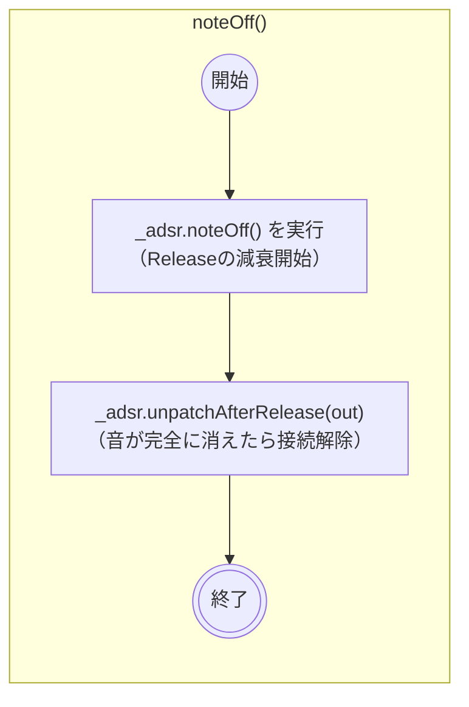

```mermaid

graph TD;
    %% noteOffの処理フロー
    subgraph NoteOff ["noteOff()"]
    direction TB
        StartOff(("開始")) --> TriggerOff["_adsr.noteOff() を実行<br>（Releaseの減衰開始）"]
        TriggerOff --> Unpatch["_adsr.unpatchAfterRelease(out)<br><span style='white-space: nowrap;'>（音が完全に消えたら接続解除）"]
        Unpatch --> End3((("終了")))
    end

```
