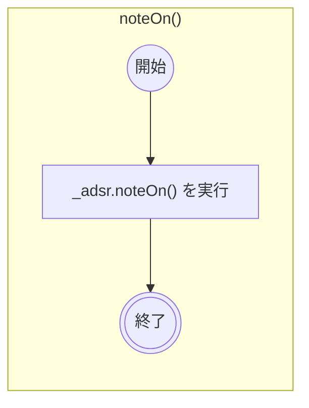

```mermaid

graph TD;
    %% noteOnの処理フロー
    subgraph NoteOn ["noteOn()"]
    direction TB;
        StartOn(("開始")) --> TriggerOn["_adsr.noteOn() を実行"]
        TriggerOn --> End2((("終了")))
    end

```
